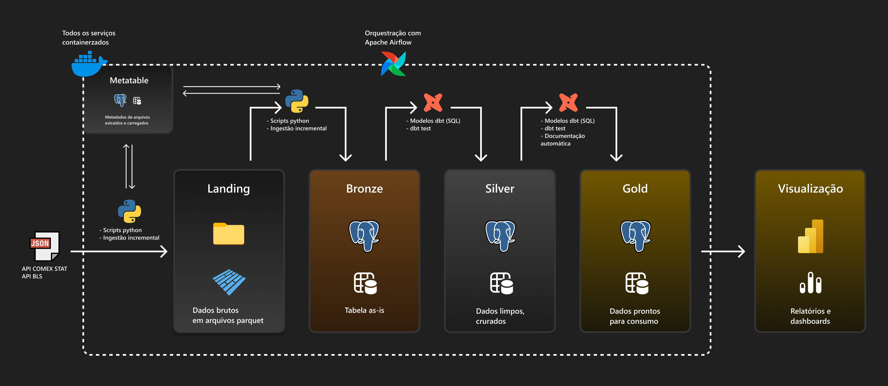

# 🎣 Projeto end-to-end de Análise da balança comercial de pescado


**Da ingestão ao dashboard:** esse projeto apresenta uma solução completa de um pipeline de dados utilizando ferramentas open source, partindo desde a ingestão de dados do comércio internacional de pescado da API COMEX STAT, até a elaboração de um dashboard no Power BI demonstrando as principais KPI's envonvidas no setor.

>O papel desse projeto é demonstrar o dia-a-dia de um Analitycs Engineer, utilizando ferramentas para tratar de ingestão, qualidade de dados, documentação, performance, e análise de dados.

## 🏛️ Arquitetura



## 🔎 Problema

Decisões estratégicas de negócio, seja no ambiente privado ou institucional, se não são, deveriam ser tomadas através de dados que sejam confiáveis. Porém, quando se trata de recursos pesqueiros, sejam eles advindos da pesca ou da aquicultura, a disponibilidades de dados e estatísticas é muito carente.

Pensando nisso, esse projeto constrói uma solução do início ao fim e demonstra, através de uma série de processos que vão desde a ingestão incremental dos dados, tratamento de registros e visualização, que através dos dados grandes decisões podem ser tomadas de maneira eficiente e com confiança.

## 🛠️ Stack Tecnológico

| Componente | Ferramenta | Função |
|:--|:--|:--|
| 🔄 Ingestão | **Python** | API request (Full/Incremental) |
| 🗄️ Data Warehouse | **PostgreSQL 15** | Armazenamento estruturado (OLAP) |
| 🔨 Transformação | **DBT 1.9** | ELT com testes e documentação automática |
| 🔀 Orquestração | **Apache Airflow 2.8** | DAGs, scheduling, retry |
| 📊 Visualização | **Power BI** | Dashboards e KPIs de negócio |
| 🐳 Infra | **Docker Compose** | Todos os serviços containerizados |

## 📐 Decisões de Desenvolvimento

### Arquitetura Medalhão

Esse tipo de arquitetura em camadas é utilizado para organizar logicamente os dados.

`Bronze`: armazena todos os dados brutos de origem externa.

`Silver`: combina, faz merge, adapta e "limpa" os dados da camada `bronze`.

`Gold`: disponibiliza os dados consumíveis para ferramentas de visualização de dados.

### ELT vs ETL

No modelo ETL (Extract, Transform, Load) os dados são carregados para dentro do banco somente após as transformações, deixando toda a documentação do projeto a cargo do desenvolvedor. Já o padrão ELT (Extract, Load, Transform) aproveita todo o poder do banco de dados para a realização das transformações e aproveita a capacidade do dbt de gerar documentações técnicas acerca do projeto.

## 📁 Estrutura do Projeto

```markdown
fish-trade-analytics/
│
├── airflow/                    # Orquestração do pipeline com Apache Airflow
│   ├── dags/                   # Definição das DAGs
│   ├── logs/                   # Logs de execução
│
├── data/
│   └── raw/                    # Zona de pouso — arquivos Parquet extraídos da API
│
├── dbt/                        # Projeto dbt — transformações das camadas Silver e Gold
│   ├── macros/                 # Macros SQL reutilizáveis
│   ├── models/
│   │   ├── silver/             # Camada Silver — limpeza e padronização
│   │   └── gold/               # Camada Gold — modelo dimensional para BI
│
├── notebooks/                  # Análise exploratória dos dados
│
├── postgres/
│   └── init/                   # Scripts de inicialização do PostgreSQL
│
└── scripts/                    # Scripts Python de ingestão
```

## 🗄️ PostgresSQL - Data Warehouse

Dentro do banco de dados é onde a mágica acontece. Os arquivos *raw* são carregados como tabelas, que em seguida são transformados utilizando fundamentos de **Data Cleaning** e posteriormente são validados e ficam disponíveis para consumo em ferramenta de visualização.

### Schemas Criados

- **metadata**: metadados referentes à extração via API e carga dos dados para o banco.
- **bronze**: dados brutos extraídos via scripts Python.
- **silver**: dados limpos. padronizados e validados via DBT.
- **gold**: dados prontos para consumo/análise.

### Bancos de Dados

- **datawarehouse**: banco principal com as camadas medalhão.
- **airflow**: banco de metadados do Apache Airflow.

### Scripts de Inicialização

O script `create_database_airflow.sh` na pasta init/ é executado automaticamente na primeira vez que o container PostgreSQL é iniciado, em ordem alfabética.