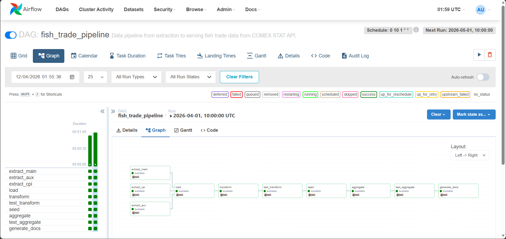
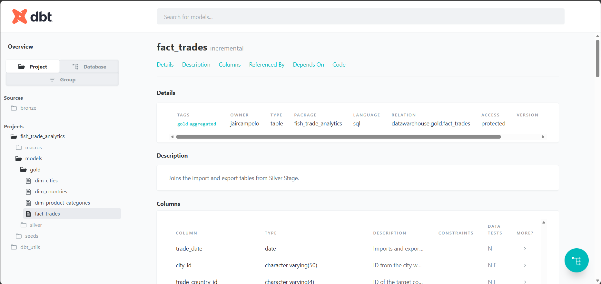
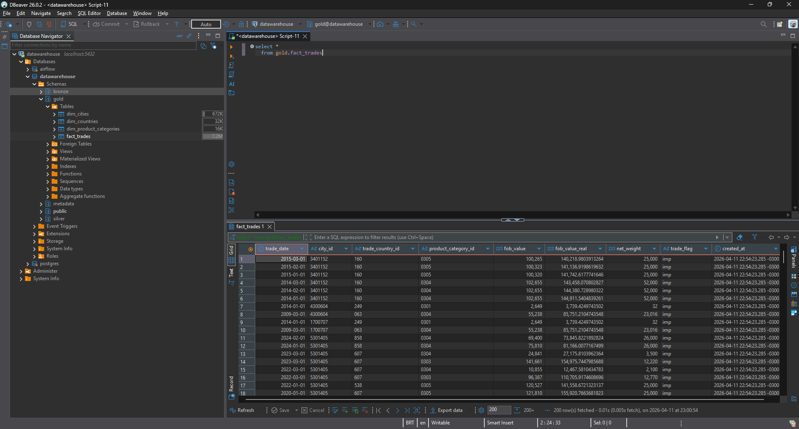
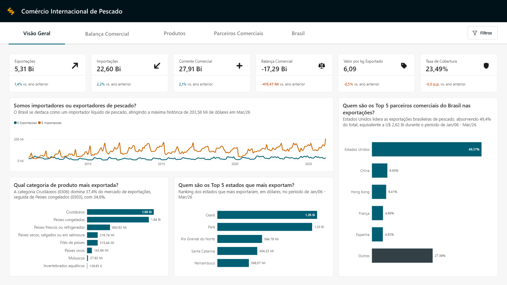

# 🎣 Projeto end-to-end de Análise da balança comercial de pescado


**Da ingestão ao dashboard:** esse projeto apresenta uma solução completa de um pipeline de dados utilizando ferramentas open source, partindo desde a ingestão de dados do comércio internacional de pescado da API COMEX STAT, até a elaboração de um dashboard no Power BI demonstrando as principais KPI's envonvidas no setor.

>O papel desse projeto é demonstrar o dia-a-dia de um Analytics Engineer, utilizando ferramentas para tratar de ingestão, qualidade de dados, documentação, performance, e análise de dados.

## 🏛️ Arquitetura

O projeto utiliza o padrão ELT (Extract, Load, Transform) e a Arquitetura Medalhão para garantir a rastreabilidade e qualidade dos dados.


## 🔎 Problema

A tomada de decisões estratégicas no setor pesqueiro e de aquicultura muitas vezes é dificultada pela carência de dados centralizados e confiáveis. Este projeto resolve esse problema ao:

1. Automatizar a coleta de dados da balança comercial brasileira.
2. Garantir a integridade dos dados através de testes automatizados.
3. Transformar registros brutos em KPIs acionáveis para análise de mercado.

## 🛠️ Stack Tecnológico

| Componente | Ferramenta | Função |
|:--|:--|:--|
| 🔄 Ingestão | **Python** | API request (Full/Incremental) |
| 🗄️ Data Warehouse | **PostgreSQL 15** | Armazenamento estruturado (OLAP) |
| 🔨 Transformação | **DBT 1.9** | Modelagem SQL, testes e documentação |
| 🔀 Orquestração | **Apache Airflow 2.8** | Gerenciamento de DAGs e agendamento |
| 📊 Visualização | **Power BI** | Dashboards e métricas de negócio |
| 🐳 Infraestrutura | **Docker Compose** | Containerização de todo o ecossistema |

## 📐 Decisões de Desenvolvimento

### Arquitetura Medalhão

Esse tipo de arquitetura em camadas é utilizado para organizar logicamente os dados.

`Bronze`: armazena todos os dados brutos de origem externa.

`Silver`: combina, faz merge, adapta e "limpa" os dados da camada `bronze`.

`Gold`: disponibiliza os dados consumíveis para ferramentas de visualização de dados.

### ELT vs ETL

No modelo ETL (Extract, Transform, Load) os dados são carregados para dentro do banco somente após as transformações, deixando toda a documentação do projeto a cargo do desenvolvedor. Já o padrão ELT (Extract, Load, Transform) aproveita todo o poder do banco de dados para a realização das transformações e aproveita a capacidade do dbt de gerar documentações técnicas acerca do projeto.

## 🖥️ Projeto em Funcionamento

### Apache Airflow — Orquestração de DAG

A DAG `trade_fish_dag` gerencia o pipeline mensalmente, garantindo que a extração e as transformações ocorram na ordem correta.



###  DBT Docs — Documentação Automática

Toda a linhagem de dados e metadados das colunas são documentados automaticamente.



### PostgreSQL — Camada Gold no DBeaver

Dados na camada Gold prontos para consumo e estruturados através da modelagem dimensional Star Schema.



### Power BI — Dashboard de Comércio Internacional de Pescado

Dashboard interativo com as principais métricas de importação e exportação.

[Acesse o Dashboard Online](https://app.powerbi.com/view?r=eyJrIjoiMTgzNDkyZmEtNGIxZi00NjQ4LThhYTUtODM5Y2E4OThhNTVlIiwidCI6ImViMDcwNTQxLTQ4YWEtNDE4My05MmEyLTFkZWFjMTZmM2M0ZSJ9)



## 📁 Estrutura do Projeto

```
📁 fish-trade-analytics/
│   
├── 📁 airflow/                     # Orquestração do pipeline com Apache Airflow
│   ├── 📁 dags/                    # Definição das DAGs
│   ├── 📁 logs/                    # Logs de execução
│
├── 📁 analytics/                   # Power BI Project
│   ├── 📁 analytics.Report/        # Definição visual, layout das páginas e metadados do relatório (Power BI)
│   ├── 📁 analytics.SemanticModel/ # Modelo semântico: tabelas, medidas DAX, relacionamentos e scripts M
│
├── 📁 data/
│   └── 📁 raw/                     # Zona de pouso — arquivos Parquet extraídos da API
│
├── 📁 dbt/                         # Projeto dbt — transformações das camadas Silver e Gold
│   ├── 📁 macros/                  # Macros reutilizáveis
│   ├── 📁 models/  
│   │   ├── 📁 silver/              # Camada Silver — limpeza e padronização
│   │   └── 📁 gold/                # Camada Gold — modelo dimensional para BI
│   └── 📁 seeds/                   # Dados estáticos (CSV)
│
├── 📁 notebooks/                   # Análise exploratória dos dados
│
├── 📁 postgres/
│   └── 📁 init/                    # Scripts de inicialização do PostgreSQL
│
├── 📁 scripts/                     # Scripts Python de ingestão
│
├── 📄 .env                         # Variáveis de ambiente e credenciais sensíveis
├── 📄 .gitignore                   # Arquivos e pastas ignorados pelo Git
├── 📄 docker-compose.yml           # Definição e orquestração dos serviços Docker
├── 📄 LICENSE                      # Termos de licença e uso do projeto
├── 📄 pyproject.toml               # Configurações de dependências e build do Python
├── 📄 README.md                    # Documentação principal do projeto
└── 📄 uv.lock                      # Travamento de versões das dependências (uv)
```

## 🔨 DBT (Data Build Tool)

A etapa de transformação de dados foi realizada com DBT através de comandos SQL

### Camadas

### Silver (Cleaned Data)

Dados limpos, padronizados e validados.

**Modelos:**

- `silver_exports.sql` - Padronização dos dados de exportação
- `silver_imports.sql` - Padronização dos dados de importação
- `silver_cities.sql` - Enriquecimento com tabelas auxiliares de estados
- `silver_countries.sql` - Padronização de nomenclaturas
- `silver_cpi.sql` - Padronização de datas e nomenclaturas

### Gold (Modelo Dimensional)

Dados prontos para consumo analítico

**Modelos:**

- `fact_trades.sql` - União de fatos de importação e exportação e padronização de FKs (Foreign Keys)
- `dim_cities.sql` - Dimensão de cidades, categorizadas por estado e região
- `dim_countries.sql` - Dimensão de países
- `dim_product_categories.sql` - Dimensão de categoria de produtos, com ID (código SH4), nome e descrição

### Seeds

Alimentam a camada analítica com arquivos CSV estáticos

**Arquivos:**

- `seed_product_categories.csv` - Categoria de produtos, com ID (código SH4), nome e descrição
- `seed_state_regions.csv` - Regiões do Brasil para cada estado

### Testes de Qualidade

- **Uniqueness**: IDs únicos
- **Not Null**: Campos obrigatórios
- **Relationships**: Integridade referencial

## 🗄️ PostgresSQL - Data Warehouse

Dentro do banco de dados é onde a mágica acontece. Os arquivos *raw* são carregados como tabelas, que em seguida são transformados utilizando fundamentos de **Data Cleaning** e posteriormente são validados e ficam disponíveis para consumo em ferramenta de visualização.

### Schemas Criados

- **metadata**: metadados referentes à extração via API e carga dos dados para o banco.
- **bronze**: dados brutos extraídos via scripts Python.
- **silver**: dados limpos. padronizados e validados via DBT.
- **gold**: dados prontos para consumo/análise.

### Bancos de Dados

- **datawarehouse**: banco principal com as camadas medalhão.
- **airflow**: banco de metadados do Apache Airflow.

### Scripts de Inicialização

O script `create_database_airflow.sh` na pasta init/ é executado automaticamente na primeira vez que o container PostgreSQL é iniciado, em ordem alfabética.

## 📝 Licença

MIT License — veja [LICENSE](LICENSE) para detalhes.